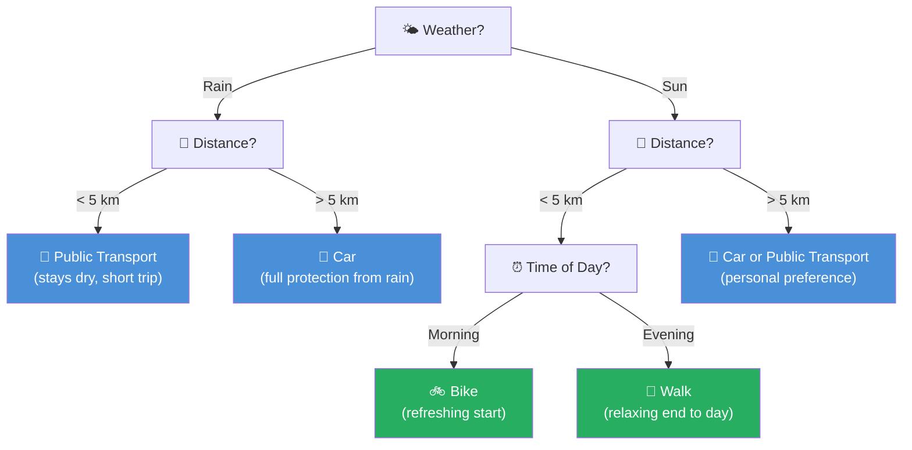

# Decision Trees — Theory & Concepts
*Course: Machine Learning K4.0031 | Sections 3.6.1 – 3.6.2*

---

## 1. What is a Decision Tree?

A decision tree is a classification model that works by asking a series of yes/no questions about the data. Starting from a **root node** (the first question), each answer leads you down a **branch** to either another question (**internal node**) or a final answer (**leaf node**).

The tree is built by repeatedly splitting the training data at the point that gives the **most useful separation** — measured by something called **Information Gain**.

> **Analogy:** Think of it like a game of 20 questions. You start with the most powerful question that divides the group in half as cleanly as possible, then keep narrowing down until every group is "pure" (everyone in the group belongs to the same class).

---

## 2. Key Vocabulary

| Term | Meaning |
|---|---|
| **Root node** | The very first question at the top of the tree |
| **Internal node** | A question node that leads to more questions |
| **Branch** | A path taken based on a yes/no answer |
| **Leaf node** | A terminal node — no more questions, just a class label |
| **Depth** | How many levels of questions the tree has |
| **Pruning** | Deliberately limiting the tree's depth to prevent overfitting |

---

## 3. How the Tree is Built — Information Gain

The algorithm always asks: *"Which question gives me the best split right now?"*

To answer that, it measures **Information Gain (IG)**:

```
IG(Dp, f) = I(Dp) − Σ (Nj / Np) × I(Dj)
```

Where:
- `Dp` = the parent node's dataset
- `Dj` = the j-th child node's dataset
- `I(·)` = impurity of a node (how mixed-up the classes are)
- `Np` = number of samples in the parent
- `Nj` = number of samples in the j-th child

**The goal:** Maximise IG. The lower the impurity of the child nodes, the higher the information gain — and the better the split.

In practice (and in scikit-learn), trees are **binary**: every node splits into exactly two children — left and right.

---

## 4. Three Ways to Measure Impurity

### 4.1 Entropy (IH)

Entropy measures disorder. A node is "pure" (entropy = 0) when all its samples belong to the same class. It is maximised when samples are evenly split across all classes.

```
IH(t) = −Σ p(i|t) × log₂ p(i|t)
```

For a two-class problem:
- All one class → entropy = **0** (perfectly pure)
- 50/50 split → entropy = **1** (maximum disorder)

### 4.2 Gini Coefficient (IG)

The Gini coefficient measures the probability of misclassifying a randomly chosen sample. It is 0 when a node is pure, and reaches 0.5 for a perfectly mixed two-class split.

```
IG(t) = 1 − Σ p(i|t)²
```

For a perfectly mixed two-class node: `IG = 1 − (0.5² + 0.5²) = 0.5`

### 4.3 Classification Error (IE)

```
IE(t) = 1 − max{ p(i|t) }
```

Useful for **pruning** an existing tree, but **not** recommended for building one — it is less sensitive to small changes in class probabilities and can miss better splits.

---

## 5. Why Gini and Entropy Beat Classification Error

Consider a parent node with 40 samples of class 1 and 40 of class 2, split two ways:

```
Split A:            Split B:
(40, 40)            (40, 40)
  ├── (30, 10)        ├── (20, 40)
  └── (10, 30)        └── (20, 0)   ← pure node!
```

**Using Classification Error**, both splits give IG = 0.25 — it cannot tell them apart.

**Using Gini**, Split B scores higher (IG = 0.167 vs 0.125) because it produces one pure node — this is the genuinely better split.

**Using Entropy**, Split B also wins (IG = 0.31 vs 0.19) for the same reason.

> **Key takeaway:** Gini and Entropy both reward splits that produce at least one pure child node. Classification Error does not. This is why scikit-learn defaults to Gini.

---

## 6. Exercise 3.Ü.03 — Transportation Decision Tree

The exercise asks you to build a decision tree for choosing how to get to work, using three features in order: **Weather → Distance → Time of Day**.

### The Tree



### Justification for Each Leaf Node

| Conditions | Choice | Reason |
|---|---|---|
| Rain + < 5 km | 🚌 Public Transport | Short enough to avoid much walking; covered stops minimise getting wet |
| Rain + > 5 km | 🚗 Car | Full shelter needed for longer journeys in bad weather |
| Sun + > 5 km | 🚗 / 🚌 | Distance is too far to walk or cycle comfortably; choice depends on parking and cost |
| Sun + < 5 km + Morning | 🚲 Bike | Energising physical activity to start the working day |
| Sun + < 5 km + Evening | 🚶 Walk | Leisurely pace to decompress after work |

---

## 7. Building a Decision Tree in scikit-learn

```python
from sklearn.tree import DecisionTreeClassifier

# Create the classifier — Gini impurity, maximum 4 levels deep
decision_tree = DecisionTreeClassifier(
    criterion='gini',   # impurity measure: 'gini' or 'entropy'
    max_depth=4,        # pruning: limits tree depth to prevent overfitting
    random_state=1      # reproducibility
)

decision_tree.fit(X_train, y_train)
```

### Key Parameters

| Parameter | What it controls |
|---|---|
| `criterion` | Which impurity measure to use (`'gini'` or `'entropy'`) |
| `max_depth` | Maximum number of levels — the main pruning tool |
| `random_state` | Seed for reproducibility when there are ties in splits |

---

## 8. Visualising the Tree

scikit-learn can render the trained tree directly:

```python
from sklearn import tree
import matplotlib.pyplot as plt

tree.plot_tree(decision_tree)
plt.show()
```

For a more detailed, colour-coded image using GraphViz:

```python
from pydotplus import graph_from_dot_data
from sklearn.tree import export_graphviz

dot_data = export_graphviz(
    decision_tree,
    filled=True,
    rounded=True,
    class_names=['Setosa', 'Versicolour', 'Virginica'],
    feature_names=['petal length', 'petal width'],
    out_file=None
)

graph = graph_from_dot_data(dot_data)
graph.write_png('decision_tree.png')
```

---

## 9. Decision Boundaries

Decision trees divide the feature space into **axis-aligned rectangles**. Each leaf node corresponds to one rectangular region. This is why decision tree boundaries always look like a grid — every split runs perfectly horizontal or vertical.

**The deeper the tree, the more complex the rectangles — and the higher the risk of overfitting.**

This is why `max_depth` is the primary tool for controlling model complexity in decision trees.

---

## 10. Impurity Criteria — Visual Comparison

The three criteria behave differently across the probability range p(i=1) ∈ [0, 1]:

- **Entropy** (black curve) rises the highest — it penalises disorder most strongly
- **Gini** (red dashed) sits between entropy and classification error
- **Entropy/2** (scaled, grey) overlaps closely with Gini — confirming they produce similar splits in practice
- **Classification Error** (cyan dash-dot) is the flattest — least sensitive to class imbalance

> All three reach their minimum (0) at the extremes (p = 0 or p = 1, i.e. a pure node) and their maximum at p = 0.5 (perfectly mixed).

---

*End of Decision Tree Theory Notes — K4.0031 Sections 3.6.1–3.6.2*