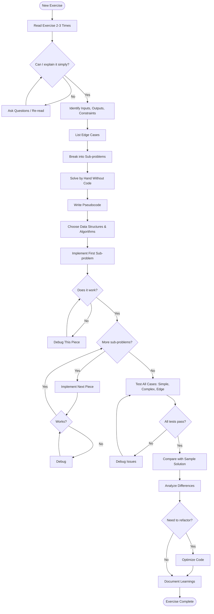
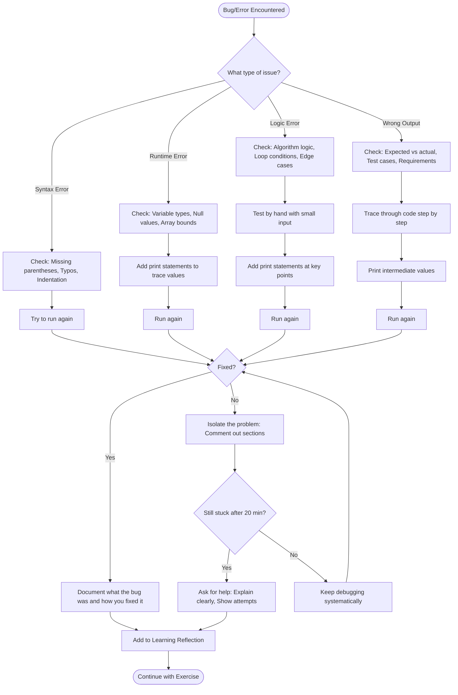
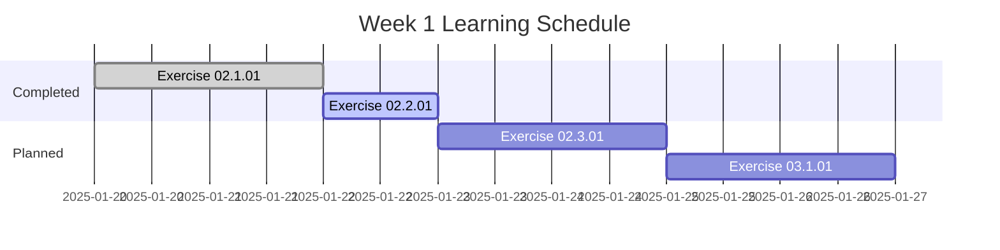
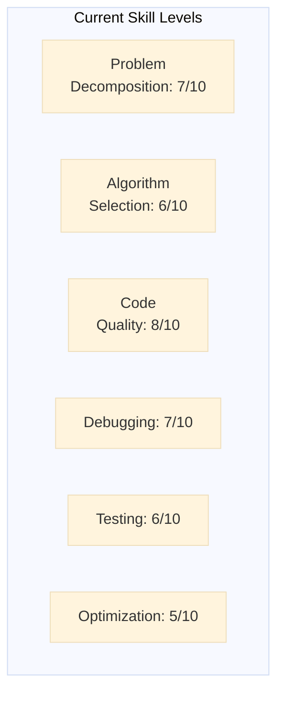

# Exercise [Number] - [Title]
**Date:** [YYYY-MM-DD]
**Status:** 🔄 In Progress / ✅ Complete / ⏸️ Paused

## Phase 1: UNDERSTAND ☐
- [ ] Read exercise 2-3 times
- [ ] Identify inputs, outputs, constraints
- [ ] Clarify ambiguities (list questions below)
- [ ] Explain problem in simple terms
- [ ] Identify edge cases

**My Understanding:**
[Write your explanation here]

**Questions/Clarifications:**
- 

**Edge Cases:**
- 

## Phase 2: PLAN ☐
- [ ] Break into sub-problems
- [ ] Solve by hand (manual approach)
- [ ] Write pseudocode
- [ ] Choose data structures/algorithms
- [ ] Estimate complexity

**Sub-Problems:**
1. 
2. 
3. 

**Pseudocode:**
```
[Your pseudocode here]
```

**Approach:**
- Data structures: 
- Algorithm: 
- Expected complexity: 

## Phase 3: IMPLEMENT ☐
- [ ] Implement first sub-problem
- [ ] Test first piece
- [ ] Build incrementally
- [ ] Follow best practices
- [ ] Handle edge cases

**Implementation Notes:**
- 

## Phase 4: TEST & DEBUG ☐
- [ ] Test with simple examples
- [ ] Test with complex examples
- [ ] Test edge cases
- [ ] Debug any issues
- [ ] Verify all requirements met

**Test Cases:**
| Input | Expected Output | Actual Output | Status |
|-------|----------------|---------------|---------|
|       |                |               |         |

**Bugs Found & Fixed:**
- 

## Phase 5: OPTIMIZE & REFLECT ☐
- [ ] Compare with provided solution
- [ ] Analyze differences
- [ ] Refactor if needed
- [ ] Document learnings

**Comparison with Sample Solution:**
- Similarities:
- Differences:
- Why their approach works:

**Key Learnings:**
- New concepts:
- Patterns to reuse:
- What I'd do differently:

## Final Notes
**Time Spent:** 
**Difficulty Level:** ⭐⭐⭐☆☆

---

# Problem-Solving Flowchart

**Visual guide for the 5-phase problem-solving methodology**

This flowchart maps out the complete problem-solving process from understanding a new exercise through to completion. Use this as a reference when working through coding exercises to ensure you follow a systematic approach.

## Methodology Flow


## How to Use This Flowchart

1. **Start at the top** with each new exercise
2. **Follow the decision diamonds** (◇) - these are critical checkpoints
3. **Loop when needed** - Notice the feedback loops for clarification, debugging, and iteration
4. **Don't skip steps** - Each phase builds on the previous one
5. **End with reflection** - Always document what you learned

## Key Decision Points

- **Can I explain it simply?** - If no, you don't understand the problem yet
- **Does it work?** - Test each piece immediately, don't wait until the end
- **More sub-problems?** - Build incrementally, one piece at a time
- **All tests pass?** - Verify thoroughly before moving to optimization
- **Need to refactor?** - Consider improvements, but don't over-engineer

**Remember:** This is an iterative process. It's normal to move back and forth between phases as you gain understanding and refine your solution.
**Confidence Level:** 🟢 High / 🟡 Medium / 🔴 Low

---

# Learning Reflection - Exercise [Number]
**Date:** [YYYY-MM-DD]
**Exercise:** [Title]

## 🎯 What I Learned Today

### New Concepts
- **Concept 1:** [Name]
  - What it is: 
  - Why it matters: 
  - How I used it: 

### New Techniques/Patterns
- **Pattern 1:** [Name]
  - Description: 
  - When to use: 
  - Example: 

### Tools/Libraries
- 
- 

## 💡 "Aha!" Moments
*Those moments when something clicked*

1. 
2. 

## 🤔 Challenges Encountered

| Challenge | How I Solved It | What I Learned |
|-----------|-----------------|----------------|
|           |                 |                |

## 📊 Comparison: My Solution vs. Sample Solution

### What I Did Well
- 
- 

### What Sample Solution Did Better
- 
- 

### Why Their Approach Works
- 

## 🔄 Patterns I Can Reuse
*Techniques or approaches worth remembering*

1. **Pattern:** 
   **When to use:** 
   **Example:** 

## 📈 Progress Tracking

**Skills Improved:**
- [ ] Problem decomposition
- [ ] Algorithm selection
- [ ] Data structure choice
- [ ] Code optimization
- [ ] Debugging
- [ ] Testing

**Confidence Level:**
- Before: 🔴 Low / 🟡 Medium / 🟢 High
- After: 🔴 Low / 🟡 Medium / 🟢 High

## 🎯 Next Steps
*What to practice or review next*

1. 
2. 
3. 

## 💭 Questions for Future Learning
*Things I'm still curious about*

---

# Debugging Decision Tree

**Systematic approach to identifying and fixing bugs**

When you encounter errors or unexpected behavior, use this decision tree to debug systematically rather than randomly trying fixes. This structured approach saves time and helps you learn from each bug you encounter.

## Debugging Process Flow


## Bug Categories & Debugging Strategies

### 🔴 Syntax Errors
**What they are:** Code doesn't follow Python syntax rules  
**Common causes:** Missing colons, unmatched brackets, typos in keywords  
**Quick fixes:** Read error message carefully, check line number, verify syntax

### 🟠 Runtime Errors
**What they are:** Code is valid but crashes during execution  
**Common causes:** Type mismatches, accessing undefined variables, division by zero  
**Debug strategy:** Add print statements before the crash point to see variable values

### 🟡 Logic Errors
**What they are:** Code runs but produces wrong results  
**Common causes:** Incorrect algorithm, wrong loop conditions, off-by-one errors  
**Debug strategy:** Test by hand with small inputs, trace through logic step-by-step

### 🟢 Wrong Output
**What they are:** Code works but doesn't meet requirements  
**Common causes:** Misunderstanding problem, missing edge cases, incorrect assumptions  
**Debug strategy:** Re-read requirements, compare expected vs actual output

## Debugging Best Practices

1. **Read error messages carefully** - They often tell you exactly what's wrong
2. **Use print statements liberally** - Print variable values at key points
3. **Test with simple inputs first** - Easier to trace through manually
4. **Isolate the problem** - Comment out code sections to find where it breaks
5. **Take breaks when stuck** - Fresh eyes often spot issues immediately
6. **Ask for help after 20 minutes** - Don't waste hours being stuck
7. **Document every bug** - Write down what was wrong and how you fixed it

## The 20-Minute Rule

If you've been stuck on the same bug for **20+ minutes** without progress:
- ✅ **DO:** Take a 5-minute break, then ask for help
- ❌ **DON'T:** Keep trying random fixes hoping something works

## After Fixing a Bug

Always complete these steps:
1. **Verify the fix** - Run all test cases, not just the one that failed
2. **Understand why it happened** - Don't just fix it, learn from it
3. **Document it** - Add to your Learning Reflection journal
4. **Prevent recurrence** - Think about how to avoid this type of bug in the future

**Remember:** Every bug you encounter and fix makes you a better programmer. The goal isn't to write perfect code the first time - it's to develop strong debugging skills.

---

# Problem-Solving Quick Reference Card

## The Five Phases
1. **UNDERSTAND** - What is the problem asking?
2. **PLAN** - How will I solve it?
3. **IMPLEMENT** - Write code incrementally
4. **TEST & DEBUG** - Does it work correctly?
5. **OPTIMIZE & REFLECT** - Can I improve it? What did I learn?

## Key Questions to Ask Yourself

### Before Coding:
- ❓ Can I explain this problem in simple terms?
- ❓ What are the inputs, outputs, and constraints?
- ❓ What edge cases should I consider?
- ❓ Can I solve this by hand first?

### During Coding:
- ❓ Am I testing each piece as I build it?
- ❓ Am I following best practices?
- ❓ Are my variable names meaningful?
- ❓ Am I handling edge cases?

### After Coding:
- ❓ Did I test all scenarios?
- ❓ How does my solution compare to the sample?
- ❓ What did I learn?
- ❓ What can I reuse next time?

## Red Flags 🚩
*Stop and reconsider if you see these*

- 🚩 Starting to code without understanding the problem
- 🚩 Not testing small pieces as you build
- 🚩 Stuck on same bug for >20 minutes without asking for help
- 🚩 Skipping edge cases
- 🚩 Not comparing with sample solution

## Problem-Solving Mantras

> "If you can't explain it simply, you don't understand it well enough."

> "Code is read more often than it's written."

> "Mistakes are your best teachers."

> "Test early, test often."

## When Stuck:
1. ⏸️ Take a 5-minute break
2. 📖 Re-read the problem
3. ✍️ Explain the problem out loud
4. 🔍 Break it down smaller
5. 💭 Try solving by hand
6. 🤝 Ask for help (after 20 min)

---

# AI Development - Learning Dashboard
**Week:** [1/2] | **Date Range:** [Start - End]

## Weekly Progress


## Exercise Completion Tracker

| Exercise | Status | Difficulty | Confidence | Key Learning | Date |
|----------|--------|------------|------------|--------------|------|
| 02.1.01  | ✅     | ⭐⭐⭐      | 🟢         | NLP basics   | 2025-01-20 |
| 02.2.01  | 🔄     | ⭐⭐⭐⭐    | 🟡         | Tokenization | 2025-01-22 |
|          |        |            |            |              |      |

**Legend:**
- Status: ✅ Complete | 🔄 In Progress | ⏸️ Paused | ❌ Blocked
- Difficulty: ⭐-⭐⭐⭐⭐⭐ (1-5 stars)
- Confidence: 🟢 High | 🟡 Medium | 🔴 Low

## Skills Development Radar


## This Week's Wins 🎉
- 
- 

## Challenges to Work On 💪
- 
- 

## Next Week Focus Areas 🎯
1. 
2. 
3.
