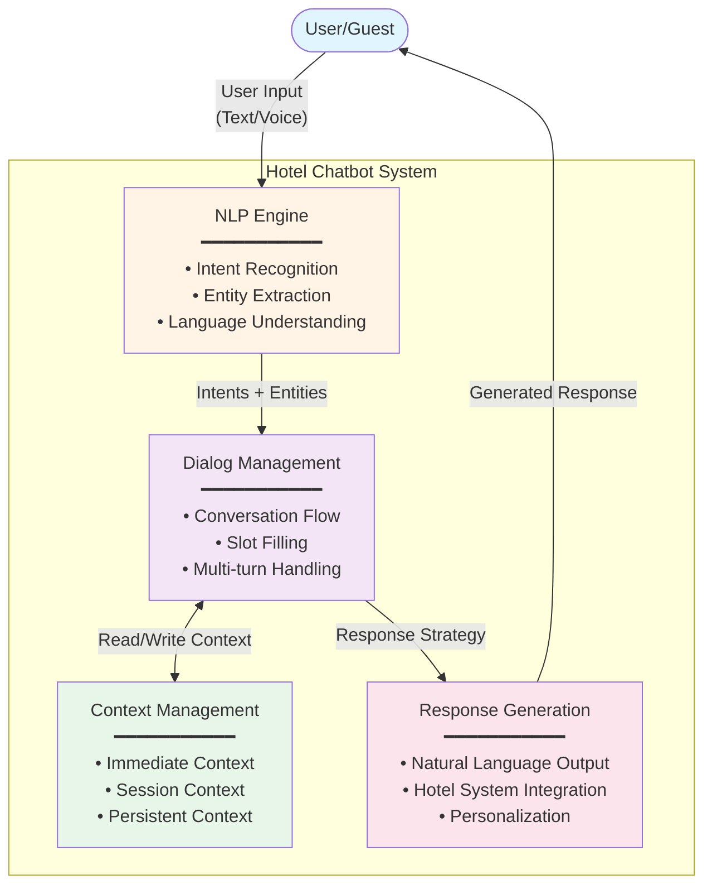

# Exercise 04.3.C.01 - Advanced Hotel Chatbot System Design

## Part (a) - Chatbot Architecture & Concept

### Overview

This document outlines the architectural design for an advanced hotel chatbot system capable of handling complex dialogues, remembering previous interactions, and providing personalized recommendations based on guest preferences and requirements.

### System Architecture

The chatbot is built on a modular architecture consisting of four core components that work together to process user inputs, manage conversations, and generate intelligent responses.

#### Architecture Diagram


### Component Breakdown

| Component | Primary Role | Key Functions | Technology Approach |
|-----------|-------------|---------------|-------------------|
| **NLP Engine** | Understanding user input | • Extract user intent (e.g., `book_room`, `ask_amenities`)<br/>• Identify entities (dates, room types, guest count)<br/>• Handle natural language variations<br/>• Process multiple languages | AI-based using pre-trained NLU models trained on hotel domain data |
| **Dialog Management System** | Controlling conversation flow | • Determine next dialog step based on context<br/>• Handle multi-turn conversations<br/>• Manage slot filling (collect missing information)<br/>• Maintain dialog state across turns | Hybrid: Rule-based for structured flows, AI-based for complex scenarios |
| **Context Management** | Storing and retrieving conversation memory | • Store immediate context (last 1-3 messages)<br/>• Maintain session context (current conversation)<br/>• Persist user preferences across sessions<br/>• Provide relevant context to other components | Database-backed storage with session IDs and user profiles |
| **Response Generation** | Producing natural, personalized outputs | • Generate contextually appropriate responses<br/>• Integrate with hotel systems (availability, pricing)<br/>• Personalize based on user profile<br/>• Format responses naturally | Hybrid: Template-based for standard responses, AI-based for dynamic content |

### Integration of Rule-Based and AI-Based Approaches

The chatbot employs a **hybrid approach** that strategically combines rule-based and AI-based techniques to optimize for both accuracy and natural interaction.

#### Rule-Based Approach

**Best suited for:**
- ✅ Simple, predictable interactions with clear structure
- ✅ Scenarios requiring 100% accuracy
- ✅ Standard FAQs with deterministic answers
- ✅ Fast response requirements

**Implementation examples:**

| Scenario | User Query | Rule-Based Response |
|----------|------------|-------------------|
| **Standard Information** | "What time is checkout?" | Direct lookup: "Checkout time is 11:00 AM" |
| **Simple Commands** | "Cancel booking #12345" | If valid booking ID → Execute cancellation |
| **Fixed Policies** | "What's the WiFi password?" | Return standard password from database |
| **Business Rules** | "Can I book for 20 people?" | If guests > room_capacity → Suggest alternatives |

#### AI-Based Approach

**Best suited for:**
- ✅ Natural language with high variation
- ✅ Complex queries requiring context understanding
- ✅ Extracting information from ambiguous sentences
- ✅ Handling unexpected phrasings

**Implementation examples:**

| Scenario | User Query | Why AI is Needed |
|----------|------------|------------------|
| **Complex Intent** | "I'm arriving really late, like maybe 2 AM, is that okay?" | AI understands this refers to late check-in despite indirect phrasing |
| **Context-Dependent** | "My kid is allergic to feathers, what kind of pillows do you have?" | AI extracts concern about pillow materials from allergy context |
| **Implicit Requests** | "We're celebrating our anniversary, any romantic touches you could add?" | AI recognizes this as a special request for room enhancements |
| **Multi-Entity Extraction** | "I need a quiet room on the top floor for two adults from December 15th to 18th" | AI extracts multiple entities: room_preference, floor, guests, dates |

#### Hybrid Decision Logic

The system uses the following logic to determine which approach to use:
```pseudocode
FUNCTION determine_approach(user_input, context):
    intent = NLP_Engine.extract_intent(user_input)
    
    IF intent in KNOWN_FAQ_LIST:
        RETURN rule_based_response(intent)
    
    ELSE IF intent.confidence_score < 0.7:
        RETURN ai_based_processing(user_input, context)
    
    ELSE IF requires_context_understanding(intent):
        RETURN ai_based_processing(user_input, context)
    
    ELSE IF intent in STRUCTURED_WORKFLOWS:
        RETURN rule_based_dialog_flow(intent)
    
    ELSE:
        RETURN ai_based_processing(user_input, context)
```

**Key advantages of hybrid approach:**
- **Reliability:** Rule-based ensures consistent handling of standard requests
- **Flexibility:** AI-based handles unexpected variations naturally
- **Efficiency:** Rules are faster for simple queries
- **Scalability:** AI handles growing complexity without manual rule creation

### Data Flow Example

**Scenario:** User asks: *"I need a quiet room on the top floor for two adults from December 15th to 18th"*

1. **NLP Engine** processes input:
   - Intent: `book_room`
   - Entities: `room_preference="quiet"`, `floor="top"`, `guests=2`, `check_in="Dec 15"`, `check_out="Dec 18"`

2. **Dialog Management** receives structured data:
   - Checks Context Management: Is this a new booking or modification?
   - Determines missing slots: payment method, contact information
   - Decides next step: Query availability

3. **Context Management** stores:
   - Session context: Current booking intent with collected entities
   - Prepares to store: Booking preferences for future sessions

4. **Response Generation** produces:
   - Natural response: "I've found quiet rooms on our top floor available for 2 guests from December 15-18. We have Superior and Deluxe options. Which would you prefer?"
   - Integrates with booking system to check real-time availability

---

## Summary

This modular architecture provides:
- **Scalability:** Components can be upgraded independently
- **Flexibility:** Hybrid approach adapts to different interaction types
- **Intelligence:** AI handles complexity while rules ensure reliability
- **Personalization:** Context management enables memory across sessions
