# Exercise 04.3.C.01 - Advanced Hotel Chatbot System Design

## Part (a) - Chatbot Architecture & Concept

### Overview

This document outlines the architectural design for an advanced hotel chatbot system capable of handling complex dialogues, remembering previous interactions, and providing personalized recommendations based on guest preferences and requirements.

### System Architecture

The chatbot is built on a modular architecture consisting of four core components that work together to process user inputs, manage conversations, and generate intelligent responses.

#### Architecture Diagram

```mermaid
flowchart TB
    User([User/Guest])
    
    subgraph ChatbotSystem["Hotel Chatbot System"]
        NLP["NLP Engine<br/>━━━━━━━━━━━<br/>• Intent Recognition<br/>• Entity Extraction<br/>• Language Understanding"]
        
        Dialog["Dialog Management<br/>━━━━━━━━━━━<br/>• Conversation Flow<br/>• Slot Filling<br/>• Multi-turn Handling"]
        
        Context["Context Management<br/>━━━━━━━━━━━<br/>• Immediate Context<br/>• Session Context<br/>• Persistent Context"]
        
        Response["Response Generation<br/>━━━━━━━━━━━<br/>• Natural Language Output<br/>• Hotel System Integration<br/>• Personalization"]
    end
    
    User -->|"User Input<br/>(Text/Voice)"| NLP
    NLP -->|"Intents + Entities"| Dialog
    Dialog <-->|"Read/Write Context"| Context
    Dialog -->|"Response Strategy"| Response
    Response -->|"Generated Response"| User
    
    style User fill:#e1f5ff
    style NLP fill:#fff4e6
    style Dialog fill:#f3e5f5
    style Context fill:#e8f5e9
    style Response fill:#fce4ec
```


### Component Breakdown

| Component | Primary Role | Key Functions | Technology Approach |
|-----------|-------------|---------------|-------------------|
| **NLP Engine** | Understanding user input | • Extract user intent (e.g., `book_room`, `ask_amenities`)<br/>• Identify entities (dates, room types, guest count)<br/>• Handle natural language variations<br/>• Process multiple languages | AI-based using pre-trained NLU models trained on hotel domain data |
| **Dialog Management System** | Controlling conversation flow | • Determine next dialog step based on context<br/>• Handle multi-turn conversations<br/>• Manage slot filling (collect missing information)<br/>• Maintain dialog state across turns | Hybrid: Rule-based for structured flows, AI-based for complex scenarios |
| **Context Management** | Storing and retrieving conversation memory | • Store immediate context (last 1-3 messages)<br/>• Maintain session context (current conversation)<br/>• Persist user preferences across sessions<br/>• Provide relevant context to other components | Database-backed storage with session IDs and user profiles |
| **Response Generation** | Producing natural, personalized outputs | • Generate contextually appropriate responses<br/>• Integrate with hotel systems (availability, pricing)<br/>• Personalize based on user profile<br/>• Format responses naturally | Hybrid: Template-based for standard responses, AI-based for dynamic content |

### Integration of Rule-Based and AI-Based Approaches

The chatbot employs a **hybrid approach** that strategically combines rule-based and AI-based techniques to optimize for both accuracy and natural interaction.

#### Rule-Based Approach

**Best suited for:**
- ✅ Simple, predictable interactions with clear structure
- ✅ Scenarios requiring 100% accuracy
- ✅ Standard FAQs with deterministic answers
- ✅ Fast response requirements

**Implementation examples:**

| Scenario | User Query | Rule-Based Response |
|----------|------------|-------------------|
| **Standard Information** | "What time is checkout?" | Direct lookup: "Checkout time is 11:00 AM" |
| **Simple Commands** | "Cancel booking #12345" | If valid booking ID → Execute cancellation |
| **Fixed Policies** | "What's the WiFi password?" | Return standard password from database |
| **Business Rules** | "Can I book for 20 people?" | If guests > room_capacity → Suggest alternatives |

#### AI-Based Approach

**Best suited for:**
- ✅ Natural language with high variation
- ✅ Complex queries requiring context understanding
- ✅ Extracting information from ambiguous sentences
- ✅ Handling unexpected phrasings

**Implementation examples:**

| Scenario | User Query | Why AI is Needed |
|----------|------------|------------------|
| **Complex Intent** | "I'm arriving really late, like maybe 2 AM, is that okay?" | AI understands this refers to late check-in despite indirect phrasing |
| **Context-Dependent** | "My kid is allergic to feathers, what kind of pillows do you have?" | AI extracts concern about pillow materials from allergy context |
| **Implicit Requests** | "We're celebrating our anniversary, any romantic touches you could add?" | AI recognizes this as a special request for room enhancements |
| **Multi-Entity Extraction** | "I need a quiet room on the top floor for two adults from December 15th to 18th" | AI extracts multiple entities: room_preference, floor, guests, dates |

#### Hybrid Decision Logic

The system uses the following logic to determine which approach to use:
```pseudocode
FUNCTION determine_approach(user_input, context):
    intent = NLP_Engine.extract_intent(user_input)
    
    IF intent in KNOWN_FAQ_LIST:
        RETURN rule_based_response(intent)
    
    ELSE IF intent.confidence_score < 0.7:
        RETURN ai_based_processing(user_input, context)
    
    ELSE IF requires_context_understanding(intent):
        RETURN ai_based_processing(user_input, context)
    
    ELSE IF intent in STRUCTURED_WORKFLOWS:
        RETURN rule_based_dialog_flow(intent)
    
    ELSE:
        RETURN ai_based_processing(user_input, context)
```

**Key advantages of hybrid approach:**
- **Reliability:** Rule-based ensures consistent handling of standard requests
- **Flexibility:** AI-based handles unexpected variations naturally
- **Efficiency:** Rules are faster for simple queries
- **Scalability:** AI handles growing complexity without manual rule creation

### Data Flow Example

**Scenario:** User asks: *"I need a quiet room on the top floor for two adults from December 15th to 18th"*

1. **NLP Engine** processes input:
   - Intent: `book_room`
   - Entities: `room_preference="quiet"`, `floor="top"`, `guests=2`, `check_in="Dec 15"`, `check_out="Dec 18"`

2. **Dialog Management** receives structured data:
   - Checks Context Management: Is this a new booking or modification?
   - Determines missing slots: payment method, contact information
   - Decides next step: Query availability

3. **Context Management** stores:
   - Session context: Current booking intent with collected entities
   - Prepares to store: Booking preferences for future sessions

4. **Response Generation** produces:
   - Natural response: "I've found quiet rooms on our top floor available for 2 guests from December 15-18. We have Superior and Deluxe options. Which would you prefer?"
   - Integrates with booking system to check real-time availability

## Summary

This modular architecture provides:
- **Scalability:** Components can be upgraded independently
- **Flexibility:** Hybrid approach adapts to different interaction types
- **Intelligence:** AI handles complexity while rules ensure reliability
- **Personalization:** Context management enables memory across sessions

---

## Part (b) - Context Management Implementation Plan

### Overview

Context management is the chatbot's memory system, enabling it to maintain coherent conversations across multiple turns and sessions. This plan outlines how the chatbot stores, retrieves, and utilizes conversational context to provide relevant and personalized responses.

### Context Types Comparison

The system implements three distinct types of context, each serving different temporal scopes and purposes:

| Context Type | Definition | Storage Method | Lifespan | Use Cases | Example |
|--------------|-----------|----------------|----------|-----------|---------|
| **Immediate Context** | Last 1-3 messages in the current exchange | In-memory buffer | Current conversation turn | • Pronoun resolution<br/>• Clarification questions<br/>• Follow-up responses | User: "Do you have sea view rooms?"<br/>Bot: "Yes, we have deluxe sea view rooms."<br/>User: "Book **it** for me" ← **"it"** resolved via immediate context |
| **Session Context** | All information within the current conversation | Session storage (Redis/memory cache) | Until conversation ends (timeout or explicit closure) | • Slot filling across turns<br/>• Intent tracking<br/>• Multi-step workflows | Entire booking conversation collecting: dates → guests → room type → payment |
| **Persistent Context** | User preferences and patterns across multiple visits | Database (user profile) | Indefinite (across sessions) | • Personalization<br/>• Preference learning<br/>• Historical patterns | Guest always books sea-view rooms, prefers late checkout, allergic to down pillows |

### Context Management Flow

The following flowchart illustrates how the chatbot determines which context type to use when processing user messages:

```mermaid
flowchart TD
    Start([New User Message Received])
    
    Start --> CheckImmediate{Is this a follow-up to<br/>last 1-3 messages?}
    
    CheckImmediate -->|Yes| UseImmediate["Use IMMEDIATE CONTEXT<br/>━━━━━━━━━━━<br/>• Resolve pronouns<br/>• Continue current topic<br/>• Use recent entities"]
    
    CheckImmediate -->|No| CheckSession{Is there an active<br/>session with ongoing intent?}
    
    CheckSession -->|Yes| UseSession["Use SESSION CONTEXT<br/>━━━━━━━━━━━<br/>• Retrieve current intent<br/>• Access collected slots<br/>• Maintain dialog state"]
    
    CheckSession -->|No| CheckProfile{Does user profile<br/>exist in database?}
    
    CheckProfile -->|Yes| UsePersistent["Use PERSISTENT CONTEXT<br/>━━━━━━━━━━━<br/>• Load user preferences<br/>• Access booking history<br/>• Apply learned patterns"]
    
    CheckProfile -->|No| NewUser["Start Fresh<br/>━━━━━━━━━━━<br/>• No context available<br/>• Begin new session<br/>• Create user profile"]
    
    UseImmediate --> Process[Process Message with Retrieved Context]
    UseSession --> Process
    UsePersistent --> Process
    NewUser --> Process
    
    Process --> Store["Store New Context<br/>━━━━━━━━━━━<br/>• Update immediate buffer<br/>• Update session data<br/>• Update user profile"]
    
    Store --> End([Generate Response])
    
    style Start fill:#e3f2fd
    style CheckImmediate fill:#fff3e0
    style CheckSession fill:#fff3e0
    style CheckProfile fill:#fff3e0
    style UseImmediate fill:#c8e6c9
    style UseSession fill:#b3e5fc
    style UsePersistent fill:#f8bbd0
    style NewUser fill:#e0e0e0
    style Process fill:#ede7f6
    style Store fill:#fff9c4
    style End fill:#e3f2fd
```


### Technical Implementation

#### 1. Storing Conversational Context

**Data Structure Design:**
```
Immediate Context Buffer {
  messages: [
    { role: "user", content: "Do you have sea view rooms?", timestamp: T1 },
    { role: "bot", content: "Yes, we have deluxe sea view rooms.", timestamp: T2 },
    { role: "user", content: "Book it for me", timestamp: T3 }
  ],
  max_size: 3  // Keep only last 3 exchanges
}

Session Context {
  session_id: "sess_abc123xyz",
  user_id: "user_456",
  start_time: "2024-12-15T10:30:00Z",
  current_intent: "book_room",
  collected_entities: {
    check_in: "2024-12-20",
    check_out: "2024-12-23",
    room_type: "deluxe_sea_view",
    guests: 2,
    special_requests: []
  },
  dialog_state: "awaiting_payment_confirmation",
  conversation_history: [ /* all messages */ ]
}

Persistent Context (User Profile) {
  user_id: "user_456",
  personal_info: {
    name: "Sarah Chen",
    email: "sarah.chen@email.com",
    loyalty_tier: "gold"
  },
  preferences: {
    room_types: ["sea_view", "quiet_floors"],
    floor_preference: "high_floors",
    amenities: ["late_checkout", "hypoallergenic_pillows"],
    communication: "email"
  },
  booking_history: [
    { date: "2024-09-10", room: "deluxe_sea_view", satisfaction: 5 },
    { date: "2024-06-15", room: "deluxe_sea_view", satisfaction: 5 },
    { date: "2024-03-20", room: "suite_sea_view", satisfaction: 4 }
  ],
  learned_patterns: {
    typical_stay_duration: 3,
    booking_lead_time: 14,  // days in advance
    price_sensitivity: "moderate"
  }
}
```

#### 2. Context Retrieval and Usage

**Pseudocode for Context Selection:**
```pseudocode
FUNCTION retrieve_context(user_id, session_id, current_message):
    // 1. Always load immediate context (last few messages)
    immediate_context = get_last_n_messages(session_id, n=3)
    
    // 2. Check if immediate context is sufficient
    IF current_message contains pronouns (it, that, them):
        RETURN immediate_context
    
    // 3. Load session context if active intent exists
    session_context = get_session_data(session_id)
    IF session_context.current_intent != NULL:
        RETURN merge(immediate_context, session_context)
    
    // 4. Load persistent context for personalization
    user_profile = get_user_profile(user_id)
    IF user_profile.exists():
        RETURN merge(immediate_context, session_context, user_profile)
    
    // 5. New user - minimal context
    RETURN immediate_context

FUNCTION update_context(user_id, session_id, new_data):
    // Update immediate buffer
    append_to_buffer(session_id, new_data.message)
    
    // Update session context
    IF new_data.contains_entities():
        update_session_entities(session_id, new_data.entities)
    
    // Update persistent context
    IF new_data.indicates_preference():
        update_user_preferences(user_id, new_data.preferences)
    
    IF new_data.completes_booking():
        add_to_booking_history(user_id, new_data.booking_details)
```

#### 3. Implementation with Session IDs and User Profiles

**Session Management:**
```
Session Lifecycle:
1. Session Creation:
   - Generate unique session_id when user initiates conversation
   - Link to user_id if authenticated, or create anonymous session
   - Initialize session context with empty state

2. Session Maintenance:
   - Store session data in fast-access cache (Redis)
   - Set timeout: 30 minutes of inactivity
   - Extend timeout with each user interaction

3. Session Closure:
   - Explicit: User says "goodbye" or completes transaction
   - Implicit: Timeout expires
   - Archive session to database for analytics
   - Extract learnings to update user profile
```

**User Profile Management:**
```
Profile Lifecycle:
1. Profile Creation:
   - Created on first booking or account registration
   - Initialize with basic information
   - Empty preferences (to be learned)

2. Profile Updates:
   - After each completed booking: Add to history
   - During conversations: Extract stated preferences
   - Pattern recognition: Identify behavioral patterns
   - Incremental learning: Confidence scores for preferences

3. Profile Usage:
   - Load at session start for returning users
   - Reference during conversation for personalization
   - Used by recommendation engine
   - Privacy-compliant: User can view/edit/delete
```

### Context Distinction in Practice

**Example Scenario:**
```
Conversation Flow:

Turn 1:
User: "I want to book a room"
Bot: "I'd be happy to help! For how many nights?"
→ SESSION CONTEXT created: { intent: "book_room" }

Turn 2:
User: "Three nights"
Bot: "Great! What dates were you planning to visit?"
→ SESSION CONTEXT updated: { intent: "book_room", duration: 3 }

Turn 3:
User: "Starting December 15th"
Bot: "Perfect! What type of room would you prefer?"
→ SESSION CONTEXT updated: { ..., check_in: "Dec 15", check_out: "Dec 18" }

Turn 4:
User: "Do you have rooms with sea view?"
Bot: "Yes, we have deluxe rooms with sea view available for Dec 15-18."
→ Uses SESSION CONTEXT to reference dates
→ Queries availability system

Turn 5:
User: "Book it"
Bot: "I'll book the deluxe sea view room for you..."
→ Uses IMMEDIATE CONTEXT: "it" = deluxe sea view room (from Turn 4)
→ Uses SESSION CONTEXT: dates, duration from earlier turns

--- Session Ends ---

Two Weeks Later:

Turn 1 (New Session):
User: "Hi, I'd like to book another room"
Bot: "Welcome back, Sarah! I see you enjoyed the sea view room last time. 
     Would you like another sea view room?"
→ Uses PERSISTENT CONTEXT: name, previous booking preference
→ Creates new SESSION CONTEXT for this booking
```

### Key Benefits of This Approach

| Benefit | Description |
|---------|-------------|
| **Coherent Conversations** | Immediate context enables natural follow-ups without repetition |
| **Multi-Turn Workflows** | Session context maintains state across complex interactions |
| **Personalization** | Persistent context enables tailored recommendations |
| **Scalability** | Tiered storage (memory → cache → database) optimizes performance |
| **Privacy Control** | Clear separation allows selective data retention policies |

---

## Part (c) - Personalized Recommendation Scenario

### Overview

This section demonstrates how the chatbot leverages collected data from previous interactions to provide intelligent, personalized recommendations. We'll walk through a concrete scenario showing data collection, storage, retrieval, and application.

### Guest Profile: Sarah Chen

**Background Information:**

Sarah Chen is a returning guest who has stayed at the hotel multiple times. Over her previous visits, the chatbot has collected and learned the following information:

| Data Category | Collected Information | Collection Method |
|---------------|----------------------|-------------------|
| **Booking History** | • 3 previous stays<br/>• All bookings were deluxe sea view rooms<br/>• Always stayed 3 nights<br/>• Books 2 weeks in advance | Transactional data from completed bookings |
| **Explicit Preferences** | • Requested late checkout (all visits)<br/>• Specified need for hypoallergenic pillows<br/>• Prefers quiet floors (away from elevators) | Directly stated during booking conversations |
| **Implicit Preferences** | • High satisfaction scores (4-5 stars)<br/>• Never inquired about budget options<br/>• Books during shoulder season (spring/fall) | Behavioral analysis and pattern recognition |
| **Special Requirements** | • Allergic to down/feather pillows<br/>• Travels with laptop (needs desk space)<br/>• Vegetarian breakfast preference | Mentioned during stays and stored in profile |

### Personalization Scenario: Sarah's Return Visit

#### Conversation Example
```
[Sarah returns to the hotel website and opens the chatbot]

Turn 1:
User: "Hi, I'd like to book a room for next month"

Bot: "Welcome back, Sarah! It's great to see you again. 

Based on your previous stays, I'd recommend our Deluxe Sea View Room on 
the 8th floor – it's quiet, has a beautiful ocean view you've enjoyed 
before, and of course, we'll ensure it's equipped with hypoallergenic 
pillows.

The room includes a spacious work desk and is available with your 
preferred late checkout option.

Would you like to book this room, or would you prefer to explore other 
options?"

Turn 2:
User: "That sounds perfect! Same dates as usual?"

Bot: "I see you typically stay for 3 nights. Looking at next month, how 
about arriving on October 15th and checking out on October 18th? 

That's about 2 weeks from now, which matches your usual booking pattern."

Turn 3:
User: "Yes, that works great!"

Bot: "Excellent! I've reserved the Deluxe Sea View Room (Room 803) for 
you from October 15-18, 2024.

I've also added a note for our staff to:
✓ Provide hypoallergenic pillows
✓ Arrange late checkout (2:00 PM instead of 11:00 AM)
✓ Ensure vegetarian options are available at breakfast

The total for your 3-night stay is $450. Would you like to use the 
credit card ending in 4532 that you used last time, or provide a 
different payment method?"

Turn 4:
User: "Use the same card, thanks!"

Bot: "Perfect! Your booking is confirmed. 

As a Gold loyalty member, I've also added a complimentary room upgrade 
to our Premium Sea View Suite at no additional charge – it has even 
better views and a larger workspace.

We look forward to welcoming you back on October 15th, Sarah! 

Is there anything else you'd like me to arrange for your stay?"
```

### Personalization Mechanics: Behind the Scenes

The following diagram illustrates how data flows through the system to enable this personalized interaction:

```mermaid
flowchart TB
    subgraph DataCollection["📊 Data Collection Phase<br/>(Previous Visits)"]
        Booking["Booking Transactions<br/>━━━━━━━━━━━<br/>• Room types booked<br/>• Stay duration<br/>• Booking lead time"]
        
        Explicit["Explicit Statements<br/>━━━━━━━━━━━<br/>• Late checkout requests<br/>• Allergy information<br/>• Dietary preferences"]
        
        Implicit["Behavioral Patterns<br/>━━━━━━━━━━━<br/>• Satisfaction ratings<br/>• Price tier preferences<br/>• Seasonal patterns"]
    end
    
    subgraph Storage["💾 Data Storage"]
        Booking --> Profile[(User Profile Database)]
        Explicit --> Profile
        Implicit --> Profile
        
        Profile --> |Structured Data| ProfileData["user_id: sarah_chen_456<br/>preferences: {<br/>  room: 'sea_view',<br/>  pillows: 'hypoallergenic',<br/>  checkout: 'late',<br/>  diet: 'vegetarian'<br/>}<br/>patterns: {<br/>  duration: 3 nights,<br/>  lead_time: 14 days<br/>}"]
    end
    
    subgraph Retrieval["🔍 Data Retrieval Phase<br/>(Current Visit)"]
        NewSession["New Session Starts<br/>━━━━━━━━━━━<br/>User: 'I'd like to book a room'"]
        
        NewSession --> Identify["Identify User<br/>━━━━━━━━━━━<br/>• Logged in: sarah_chen_456<br/>• Or: Email recognition<br/>• Or: Loyalty number"]
        
        Identify --> Load["Load Profile<br/>━━━━━━━━━━━<br/>• Retrieve preferences<br/>• Access booking history<br/>• Load learned patterns"]
        
        Profile -.->|Query| Load
    end
    
    subgraph Application["🎯 Personalization Application"]
        Load --> Recommend["Generate Recommendation<br/>━━━━━━━━━━━<br/>• Room: Deluxe Sea View (preferred)<br/>• Floor: 8th (quiet location)<br/>• Special: Hypoallergenic pillows<br/>• Extra: Late checkout offer"]
        
        Recommend --> Predict["Smart Predictions<br/>━━━━━━━━━━━<br/>• Suggest 3-night stay<br/>• Propose dates 14 days ahead<br/>• Offer saved payment method"]
        
        Predict --> Response["Personalized Response<br/>━━━━━━━━━━━<br/>'Welcome back, Sarah!'<br/>+ Tailored recommendation<br/>+ Remembered preferences<br/>+ Loyalty benefits"]
    end
    
    Response --> User([Sarah receives<br/>personalized experience])
    
    style DataCollection fill:#e3f2fd
    style Storage fill:#f3e5f5
    style Retrieval fill:#e8f5e9
    style Application fill:#fff3e0
    style Profile fill:#c5cae9
    style User fill:#ffccbc
```


### Information Collection, Storage, and Usage

#### 1. Data Collection Methods

| Information Type | How It's Collected | When It's Collected |
|------------------|-------------------|-------------------|
| **Room Preferences** | • User explicitly selects room type<br/>• Pattern recognition from multiple bookings | During booking process and post-stay analysis |
| **Special Requirements** | • User states during conversation<br/>• Extracted via NLP from natural language | Any time during conversation or in special requests field |
| **Behavioral Patterns** | • Duration: Calculated from booking history<br/>• Lead time: Time between booking and check-in<br/>• Price sensitivity: Analysis of room tier choices | Automated analysis after each completed stay |
| **Satisfaction Data** | • Post-stay survey responses<br/>• Review ratings<br/>• Repeat booking behavior | After checkout via email survey |
| **Dietary Preferences** | • Breakfast order history<br/>• Explicit statements during booking<br/>• Restaurant reservation patterns | During stay through various touchpoints |

#### 2. Storage Strategy

**Profile Database Schema:**
```
Table: user_profiles
├─ user_id (Primary Key)
├─ personal_info (JSON)
│  ├─ name
│  ├─ email
│  ├─ phone
│  └─ loyalty_tier
├─ preferences (JSON)
│  ├─ room_preferences
│  │  ├─ type: "sea_view"
│  │  ├─ floor: "high_floors"
│  │  └─ features: ["quiet", "workspace"]
│  ├─ amenities
│  │  ├─ pillows: "hypoallergenic"
│  │  ├─ checkout: "late"
│  │  └─ breakfast: "vegetarian"
│  └─ communication
│     └─ preferred_channel: "email"
├─ booking_history (Array)
│  └─ [
│     { date, room_type, duration, price, satisfaction },
│     ...
│  ]
└─ learned_patterns (JSON)
   ├─ typical_duration: 3
   ├─ booking_lead_time: 14
   ├─ preferred_season: ["spring", "fall"]
   └─ price_sensitivity: "moderate"

Table: special_requirements
├─ user_id (Foreign Key)
├─ requirement_type (e.g., "allergy", "accessibility", "dietary")
├─ description
├─ severity (critical, important, nice-to-have)
└─ date_added
```

**Privacy and Consent:**
- All data storage complies with GDPR/privacy regulations
- Users can view, edit, or delete their profile at any time
- Sensitive data (allergies, medical needs) flagged as "critical"
- Explicit consent obtained for data retention beyond legal minimum

#### 3. Recommendation Generation Process

**Step-by-step logic:**
```pseudocode
FUNCTION generate_personalized_recommendation(user_id, booking_request):
    // 1. Load user profile
    profile = get_user_profile(user_id)
    
    // 2. Analyze booking history for patterns
    preferred_room = most_frequent(profile.booking_history.room_type)
    typical_duration = median(profile.booking_history.duration)
    
    // 3. Check availability of preferred room
    available_rooms = check_availability(
        room_type = preferred_room,
        check_in = booking_request.date,
        duration = typical_duration
    )
    
    // 4. Apply special requirements as filters
    filtered_rooms = apply_filters(available_rooms, profile.special_requirements)
    
    // 5. Rank by preference match
    FOR EACH room in filtered_rooms:
        score = 0
        IF room.floor in profile.preferences.floor_preference:
            score += 10
        IF room.has_feature("quiet"):
            score += 5
        IF room.view == profile.preferences.view:
            score += 15
        room.recommendation_score = score
    
    // 6. Select best match
    best_room = max(filtered_rooms, key=recommendation_score)
    
    // 7. Generate personalized message
    message = f"Welcome back, {profile.name}! "
    message += f"Based on your previous stays, I'd recommend our {best_room.type} "
    message += f"on the {best_room.floor} floor."
    
    // 8. Add remembered special requirements
    IF profile.special_requirements.exists():
        message += " We'll ensure it's equipped with "
        message += join(profile.special_requirements)
    
    // 9. Offer value-added services based on patterns
    IF profile.preferences.checkout == "late":
        message += " with your preferred late checkout option."
    
    RETURN {
        recommended_room: best_room,
        personalized_message: message,
        confidence_score: best_room.recommendation_score
    }
```

### Key Personalization Elements in This Scenario

| Personalization Element | Source Data | Impact on Experience |
|------------------------|-------------|---------------------|
| **Greeting by name** | User profile: personal_info.name | Creates immediate recognition and connection |
| **Room recommendation** | Booking history: 3x deluxe sea view rooms | Reduces decision fatigue, shows understanding |
| **Floor selection** | Implicit preference: quiet floors pattern | Anticipates unstated need for peaceful stay |
| **Hypoallergenic pillows** | Special requirements: allergy information | Critical for safety and comfort |
| **Late checkout mention** | Explicit preference: requested 3x | Proactively offers valued service |
| **Duration suggestion** | Behavioral pattern: always 3 nights | Speeds up booking process |
| **Timing prediction** | Behavioral pattern: books 14 days ahead | Helps with planning and availability |
| **Payment method** | Transaction history: saved card | Streamlines checkout process |
| **Vegetarian breakfast** | Dietary preference: stated previously | Shows attention to detail |
| **Loyalty upgrade** | Loyalty tier: Gold member | Rewards repeat business |

### Benefits of This Personalization Approach

**For the Guest:**
- ⏱️ **Faster booking:** Reduced from 10+ back-and-forth messages to 4 turns
- 🎯 **Relevant recommendations:** No need to browse through all room types
- 🛡️ **Safety assurance:** Critical needs (allergies) automatically remembered
- ✨ **VIP treatment:** Feels recognized and valued as a returning guest

**For the Hotel:**
- 💰 **Higher conversion:** Personalized recommendations increase booking rate
- 📈 **Upsell opportunities:** Can offer upgrades based on demonstrated preferences
- 🤝 **Guest loyalty:** Recognition encourages repeat bookings
- ⚡ **Operational efficiency:** Fewer clarification questions, faster transactions
