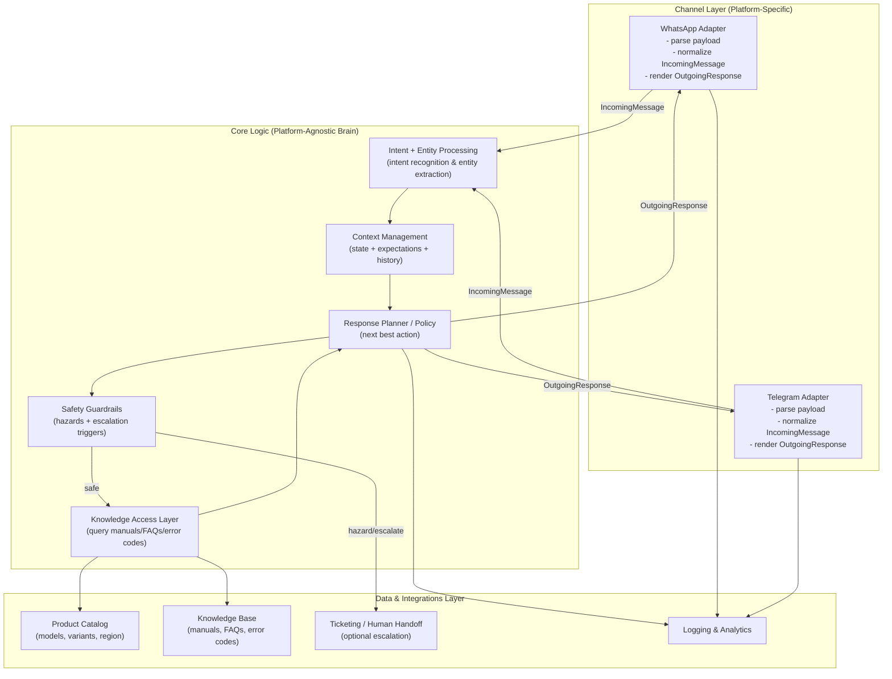

# Multi-Channel Chatbot Architecture for Household Appliances

**Exercise 07.3.Ü.01 - Multi-channel chatbots**

## Introduction

This architecture supports a customer service chatbot for household appliance support across WhatsApp and Telegram. The design separates platform-agnostic business logic (the "brain") from platform-specific adapters, enabling consistent troubleshooting quality across channels while respecting each platform's UI capabilities and user expectations. The core principle is: **same intelligence, different interfaces**.

---

## System Overview

### Architecture Diagram



### Internal Message Contract (Platform-Agnostic)

The contract defines how components communicate without platform-specific dependencies.

**IncomingMessage (adapter → core)**

```json
{
  "conversation_id": "conv_abc123",
  "user_id": "user_u456",
  "channel": "whatsapp",
  "timestamp": "2026-02-15T16:50:00Z",
  "message": { "type": "text", "text": "My dishwasher won't drain" },
  "metadata": { "locale": "en-DE", "attachments": [] }
}
```

**OutgoingResponse (core → adapter)**

```json
{
  "messages": [
    { "type": "text", "text": "Let's troubleshoot. Do you see standing water?" },
    {
      "type": "choice",
      "prompt": "Pick one:",
      "choices": [
        { "id": "A", "label": "Yes" },
        { "id": "B", "label": "No" },
        { "id": "C", "label": "Not sure" }
      ],
      "expectation_id": "exp_t789"
    }
  ]
}
```

**Context Storage (core-owned; enables round-trip validation)**

```json
{
  "conversation_id": "conv_abc123",
  "user_id": "user_u456",
  "state": {
    "current_intent": "TROUBLESHOOT_DRAIN",
    "slots": { "appliance": "dishwasher", "model": null, "error_code": null },
    "history_summary": ["User reports: won't drain"],
    "expectation": {
      "type": "choice",
      "expectation_id": "exp_t789",
      "valid_choice_ids": ["A", "B", "C"],
      "created_at": "2026-02-15T16:50:00Z"
    }
  }
}
```

**Round-trip principle:** Adapters normalize platform messages into `IncomingMessage` format. The core validates replies against stored `state.expectation` and handles repair prompts when validation fails.

---

## (a) Core Platform-Agnostic Logic

The core logic implements all business rules, conversation management, and domain knowledge independent of communication channels.

### Main Components

1. **Intent Recognition**
   - Identifies user goals from natural language (product information, troubleshooting, warranty questions, service requests, order status)
   - Routes requests to appropriate conversation flows

2. **Entity Extraction**
   - Extracts structured details from user messages: appliance type, model/serial number, error codes, symptoms, purchase dates, locale
   - Produces validated slots that other components can rely on

3. **Context Management**
   - Maintains conversation state across multiple turns: filled slots, conversation history, current position in troubleshooting flows
   - Stores expectations for user responses (enabling validation and repair)
   - Prevents repetition and supports coherent multi-turn dialogues

4. **Response Planner / Policy (Dialogue Manager)**
   - Determines the next best action: ask clarifying questions, provide diagnostic steps, retrieve knowledge, or escalate to humans
   - Applies conversation design rules (clarity, brevity, safety-first, user-friendly error recovery)

5. **Knowledge Access Layer**
   - Queries product catalog and knowledge base using structured inputs (model + symptom + locale)
   - Retrieves relevant content: troubleshooting guides, manuals, error code explanations, FAQs, known issues
   - Abstracts data storage details from business logic

6. **Safety Guardrails**
   - Monitors for hazardous situations: electrical risks, gas smells, major leaks, burning odors, sparks
   - Triggers immediate protective actions: safe shutdown guidance, emergency escalation, service ticket creation
   - Overrides normal troubleshooting flow when safety is at risk

### Component Interaction Flow with Decision Points

**Example scenario: "My dishwasher won't drain"**

1. **Adapter** receives user text → creates `IncomingMessage` with normalized format
2. **Intent Recognition** → identifies `TROUBLESHOOT_DRAIN`
3. **Entity Extraction** → extracts `{appliance: dishwasher, symptom: wont_drain, model: ?, error_code: ?}`
4. **Context Manager** updates conversation state and identifies missing critical information

   **↓ Decision Point**

5. **Safety Guardrails** evaluate potential risks:
   - **Hazard detected** → switch to safe shutdown guidance + create escalation ticket
   - **No hazard** → proceed with troubleshooting

   **↓ Proceed**

6. **Knowledge Access** queries knowledge base for relevant guidance (dishwasher + drain issue + user's locale)
7. **Response Planner** chooses next step based on available information:
   - **Missing critical info** → ask targeted clarifying question (set expectation for structured reply)
   - **Sufficient context** → provide next diagnostic instruction
   - **Repeated failure / user stuck** → escalate to human support

8. **Core** generates `OutgoingResponse` with text and optional structured interactions (choices, confirmations)
9. **Adapters** render response using platform-specific capabilities

---

## (b) Platform-Specific Adapters for WhatsApp and Telegram

Adapters act as stateless translation layers between platform-specific protocols and the internal message contract.

### Adapter Responsibilities

**Incoming Translation (platform → internal format)**

- Parse platform-specific message payloads into standardized `IncomingMessage` structure
- Normalize user identity (`user_id`), conversation threading (`conversation_id`), timestamps
- Handle media attachments by storing files securely and providing `media_ref` to core logic
- Support multiple message types: text, images, voice notes, documents

**Outgoing Translation (internal format → platform-specific rendering)**

- Render abstract `OutgoingResponse` blocks into channel-appropriate formats
- Respect platform constraints: message length limits, formatting capabilities, supported media types
- Apply platform-specific optimizations: message batching, typing indicators, read receipts

### Capability-Based Rendering Pattern

The core generates platform-agnostic UI intents; adapters choose appropriate rendering based on capabilities.

**Example: Choice Interaction**

Core emits:
```json
{
  "type": "choice",
  "prompt": "What issue are you seeing?",
  "choices": [
    {"id": "A", "label": "Won't drain"},
    {"id": "B", "label": "Not starting"},
    {"id": "C", "label": "Strange noise"}
  ]
}
```

**Telegram Adapter:**
- Renders as inline keyboard with buttons
- User clicks "Won't drain" → platform returns callback: `choice_id: "A"`
- Adapter creates: `IncomingMessage{selection: {choice_id: "A"}}`

**WhatsApp Adapter:**
- Renders as numbered text list: "1) Won't drain, 2) Not starting, 3) Strange noise - Reply 1, 2, or 3"
- User types "1" → platform delivers text message
- Adapter creates: `IncomingMessage{message: {type: "text", text: "1"}}`

**Key Principle:** Adapters are stateless translators. They normalize platform payloads into `IncomingMessage` format but don't interpret conversation meaning. The core owns all validation logic, including mapping text replies like "2" to `choice_id` values using stored expectations. This ensures adapters remain simple, testable, and platform-focused.

### Round-Trip Validation

When the core sends a `choice`, it stores the expectation in context. When the user replies:

1. Adapter forwards the normalized input (either `selection: {choice_id}` or `text: "2"`)
2. Core checks stored `expectation.valid_choice_ids`
3. Core maps text inputs to choice_ids when applicable ("2" → second choice → "B")
4. If input is invalid or ambiguous, core generates repair prompt: "Please reply with 1, 2, or 3"

This pattern keeps conversation logic in the core while allowing platform-specific interaction styles.

---

## (c) User Expectations and Platform Customizations

Different platforms foster different user expectations and interaction patterns. The chatbot adapts its communication style accordingly while maintaining consistent troubleshooting quality.

### WhatsApp: Conversational, Minimal UI

**User Mindset:** WhatsApp feels like texting a person. Users expect quick, natural back-and-forth communication with minimal "bot-like" interfaces.

**Customizations:**

- **Short, sequential messages** - Present one step or question at a time rather than long menus
- **Natural language choices** - Use numbered replies ("Reply 1, 2, or 3") instead of formal UI controls
- **Conversational tone** - Friendly, supportive language that mirrors human customer service
- **Early handoff option** - Offer "Talk to a support agent" when user seems frustrated or stuck
- **Media-friendly troubleshooting** - Encourage photos of error displays or problem areas; confirm receipt clearly

### Telegram: Structured, Bot-Friendly UI

**User Mindset:** Telegram users are accustomed to feature-rich bots with structured interfaces. They expect efficient, organized interactions with clear navigation.

**Customizations:**

- **Inline buttons and menus** - Rich UI for common actions, yes/no questions, and navigation
- **Structured troubleshooting flows** - Step cards with progress indicators and summary of attempted fixes
- **Navigation controls** - Buttons for "← Back", "↻ Restart", "⌂ Main Menu" to reduce friction
- **Bot commands** - Support `/start`, `/help`, `/status` for power users
- **Compact information display** - Use formatting (bold, lists) to present dense information clearly

### Concrete Scenario: Error Code Handling (E24 - Drainage Issue)

**WhatsApp Implementation:**

```
I see error E24. That usually points to a drainage blockage.

Let's try one quick step at a time:

1. Clean the filter
2. Check the drain hose
3. Reset the machine

Reply 1, 2, or 3.
```

**Telegram Implementation:**

```
⚠️ Error E24 — Drainage Issue

Choose what to try:

[🔧 Clean filter] [🚰 Check drain hose] [🔄 Reset machine]

[← Back] [📞 Get service help]
```

**Why These Differences Matter:**

- **WhatsApp users** expect quick back-and-forth chat → numbered lists feel natural and don't interrupt conversation flow. Excessive UI elements feel "robotic" and impersonal.

- **Telegram users** are comfortable with bot UI → buttons reduce typing effort and enable richer navigation (Back, Menu, Commands). Structured interfaces feel professional and efficient.

Both approaches lead to the same troubleshooting outcome, but each respects its platform's interaction culture.

### Cross-Channel Continuity (Optional Enhancement)

For users who switch between platforms, support account linking via magic links or one-time codes. Store conversation context under a unified user identity (not channel-specific user_id) so troubleshooting sessions can resume across platforms without repeating questions.

## Summary

This architecture achieves effective multi-channel support through three foundational principles:

1. **Platform-agnostic core logic** that handles all business rules, conversation management, safety checks, and validation independently of communication channels

2. **Stateless adapters** that translate between channel-specific protocols and internal contracts without interpreting conversation semantics

3. **Capability-based rendering** that adapts the same conversation intelligence to each platform's strengths and user expectations

The result is consistent troubleshooting quality with platform-appropriate user experiences. The household appliance company maintains a single source of product knowledge and diagnostic logic while providing native-feeling interactions on both WhatsApp and Telegram. This architecture scales efficiently: adding new channels requires only implementing new adapters while core business logic remains unchanged.

### Document Information
- **Course:** K4.0053_4.0 AI Development
- **Exercise:** 07.3.Ü.01 - Multi-channel chatbots
- **Author:** Oren
- **Date:** February 15, 2026
- **Version:** 1.0 (Final)
