# WP1 Deliverable 1: Concept Diagrams

## Executive Summary

This deliverable presents three complementary architectural diagrams that visualize InsightBridge's prompt engineering system:

1. **Diagram 1a: System Architecture** - Vertical governance hierarchy showing how cross-cutting concerns govern business domains, which leverage atomic and composite prompt types
2. **Diagram 1b: Governance & Metadata Layer** - Metadata structure enabling scalability to 500+ prompts through lifecycle tracking, ownership, and dependency management
3. **Diagram 2: Executive Dashboard Workflow** - Horizontal workflow sequence demonstrating multi-stage data transformation with decision-driven branching

These diagrams establish the architectural foundation for all subsequent work packages (WP2-5).

---

## Design Philosophy

### Visual Language Strategy

**Diagram 1a: Vertical Flow (Structural Architecture)**
- Purpose: Show governance hierarchy and capability layers
- Direction: Top-down (guardrails → domains → prompt types)
- Relationship: Governance flows down; capabilities flow up

**Diagram 2: Horizontal Flow (Temporal Sequence)**
- Purpose: Show workflow execution and data transformation
- Direction: Left-to-right (query → processing → output)
- Relationship: Sequential transformation with decision branching

**Rationale:** Different visual languages for different purposes demonstrates professional documentation maturity. Structural vs. temporal concerns require distinct diagram styles.

---

## Diagram 1a: System Architecture Overview

### Purpose
Illustrate the complete prompt system architecture showing:
- Cross-cutting concerns (canonical data, voice/compliance, operational quality)
- Business domains (Customer Support, Content Creation, Data Analysis, Software Development)
- Atomic prompt types (5 foundational building blocks)
- Orchestrated workflows (composite coordination layer)

### Key Design Decisions

**1. Vertical Hierarchy**
- Places governance at the top (applies to all domains)
- Business domains in the middle (organizational structure)
- Prompt capabilities at the bottom (technical primitives)

**2. Minimal Arrow Usage**
- Avoids M:N relationship spaghetti
- Two arrows only: Guardrails→Domains, AtomicTypes→Domains
- Structure implies relationships without explicit drawing

**3. Separation of Atomic vs. Composite**
- Atomic prompt types shown as reusable primitives
- Orchestrated workflows shown as separate layer
- Yellow highlight on orchestration emphasizes meta-layer status

### Rendered Diagram

**See:** `WP1_Deliverable_1_Diagrams.pdf` - Page 1

### Mermaid Source Code

```mermaid
graph TB
    subgraph Guardrails["⚙️ Cross-Cutting Concerns"]
        CDC["Canonical Data &<br/>Terminology"]
        VCG["Voice & Compliance<br/>Guardrails"]
        OQS["Operational Quality<br/>Standards"]
    end
    
    subgraph Domains["🏢 Business Domains"]
        CS[Customer Support]
        CC[Content Creation]
        DA[Data Analysis]
        SD[Software Development]
    end
    
    subgraph AtomicTypes["🔷 Atomic Prompt Types"]
        RET[Retrieval &<br/>Fact Lookup]
        EXP[Explanation &<br/>Education]
        GEN[Content<br/>Generation]
        DIA[Diagnostic &<br/>Troubleshooting]
        DEC[Decision Support<br/>& Insight]
    end
    
    subgraph CompositeLayer["🔶 Orchestrated Workflows"]
        ORC[Composite Prompts<br/>Multi-step Coordination]
    end
    
    %% Governance flows down
    Guardrails --> Domains
    
    %% Capabilities flow up to domains
    AtomicTypes --> Domains
    
    %% Atomic types compose into workflows
    AtomicTypes --> CompositeLayer
    
    %% Styling
    style Guardrails fill:#ffebee,stroke:#b71c1c,stroke-width:2px
    style Domains fill:#f3e5f5,stroke:#4a148c,stroke-width:2px
    style AtomicTypes fill:#e1f5fe,stroke:#01579b,stroke-width:2px
    style CompositeLayer fill:#fff9c4,stroke:#f57f17,stroke-width:3px
```

### Architectural Insights

**Governance Layer (Top)**
- Canonical Data & Terminology: Single source of truth for business facts
- Voice & Compliance Guardrails: Brand tone, legal constraints, ethical boundaries
- Operational Quality Standards: Performance SLAs, accuracy thresholds, monitoring requirements

**Business Domains (Middle)**
- Each domain represents organizational ownership boundary
- Domains consume prompt capabilities based on business needs
- Cross-domain patterns emerge (multiple domains use similar prompt types)

**Prompt Type Capabilities (Bottom)**
- Five atomic types serve as reusable building blocks
- Atomic prompts are stateless, focused, and testable
- Orchestrated workflows coordinate multiple atomic prompts with state management

### Connection to Course Concepts
- **K4.0052 Chapter 3:** Modular prompt design and reusability
- **K4.0052 Chapter 7:** Custom GPT architecture and system organization
- **Best Practices:** Separation of concerns, hierarchical design, governance-first thinking

---

## Diagram 1b: Governance & Metadata Layer

### Purpose
Detail the metadata structure that enables:
- Prompt lifecycle management (draft → active → deprecated → archived)
- Ownership accountability (team and individual responsibility)
- Dependency tracking (upstream sources, downstream consumers)
- Quality verification (last tested date and method)

### Key Design Decisions

**1. Metadata as First-Class Citizens**
- Lifecycle Status: Prevents outdated prompts from being used
- Owner: Clear accountability for maintenance
- Last Verified: Ensures prompts are periodically validated
- Dependencies: Enables impact analysis when changes occur

**2. Example-Driven Visualization**
- Shows atomic prompt example (RET-BILL-INVOICE-HISTORY)
- Shows composite workflow example (WF-BILLING-INQUIRY)
- Demonstrates dependency relationship between them

**3. Benefits Callout**
- Explicitly links metadata fields to scaling benefits
- Shows how dependencies enable impact analysis, test automation, load-bearing identification

### Rendered Diagram

**See:** `WP1_Deliverable_1_Diagrams.pdf` - Page 2

### Mermaid Source Code

```mermaid
graph TB
    subgraph MetadataLayer["📋 Prompt Governance Metadata"]
        LCS["Lifecycle Status<br/><small>Draft | Active | Deprecated</small>"]
        OWN["Owner<br/><small>Team + Individual</small>"]
        VER["Last Verified<br/><small>Date + Method</small>"]
        DEP["Dependencies<br/><small>Upstream | Downstream</small>"]
    end
    
    subgraph Examples["Example Applications"]
        direction LR
        
        subgraph AtomicEx["Atomic Prompt"]
            PRET["<b>RET-BILL-INVOICE-HISTORY</b><br/>Domain: Customer Support<br/>Category: Retrieval<br/>Status: Active<br/>Owner: Support Ops"]
        end
        
        subgraph WorkflowEx["Composite Workflow"]
            WFLOW["<b>WF-BILLING-INQUIRY</b><br/>Category: Orchestrated<br/>Status: Active<br/>Owner: CX Engineering"]
        end
    end
    
    MetadataLayer -.->|"applied to<br/>every prompt"| Examples
    
    WFLOW -->|"depends on"| PRET
    
    subgraph Benefits["Governance at Scale (500+ prompts)"]
        B1["<b>Impact Analysis</b><br/>Track cascade effects"]
        B2["<b>Test Automation</b><br/>Trigger regression tests"]
        B3["<b>Load-Bearing ID</b><br/>Prioritize critical prompts"]
        B4["<b>Decay Detection</b><br/>Flag stale prompts"]
    end
    
    DEP -.->|enables| Benefits
    
    style MetadataLayer fill:#e8f5e9,stroke:#1b5e20,stroke-width:2px
    style Examples fill:#f5f5f5,stroke:#616161,stroke-width:2px
    style AtomicEx fill:#e1f5fe,stroke:#01579b,stroke-width:2px
    style WorkflowEx fill:#fff9c4,stroke:#f57f17,stroke-width:2px
    style Benefits fill:#fce4ec,stroke:#880e4f,stroke-width:2px
```

### Metadata Field Specifications

**Lifecycle Status**
- `draft`: Under development, not production-ready
- `active`: Deployed and validated
- `deprecated`: Scheduled for retirement, maintain during migration period
- `archived`: Retired, kept for audit trail only

**Owner**
- Team: Domain responsibility (Support Ops, Marketing Ops, Data Platform, Engineering)
- Individual: Point of contact for updates and maintenance
- Purpose: Clear accountability prevents orphaned prompts

**Last Verified**
- Date: When prompt was last tested against current data/policies
- Method: Validation approach (manual-review, automated-testing, a-b-comparison, user-feedback-analysis)
- Purpose: Detect prompt decay as business context changes

**Dependencies**
- Upstream: Atomic prompts or data sources this prompt relies on
- Downstream: Workflows or systems that consume this prompt
- Purpose: Impact analysis, regression testing, load-bearing identification

### Scaling Scenario: When RET-BILL-INVOICE-HISTORY Changes

**Automatic Actions Triggered:**
1. Dependency graph identifies WF-BILLING-INQUIRY as downstream consumer
2. Regression test suite automatically triggered for dependent workflow
3. Owner (Support Ops) receives notification of change requiring review
4. Load-bearing analysis shows this prompt supports 12 workflows (high priority)
5. Last Verified date determines review urgency

**Manual Interventions Required:**
- Support Ops reviews changes for functional correctness
- QA team validates dependent workflows pass regression tests
- Product owner approves deployment based on impact assessment

### Connection to Course Concepts
- **K4.0052 Chapter 11:** Prompt evaluation and monitoring
- **K4.0052 Best Practices:** Version control, documentation standards, quality assurance
- **WP3 Preparation:** Metrics structure enables analytics
- **WP4 Preparation:** Dependencies enable integrity checks

---

## Diagram 2: Executive Dashboard Workflow - Revenue Analysis

### Purpose
Demonstrate a real production workflow that:
- Chains multiple atomic prompt types in sequence
- Shows decision-driven branching based on data quality
- Illustrates guardrail enforcement at specific integration points
- Proves architectural value of orchestration layer

### Business Scenario

**User Query:** "Why did EMEA Q3 revenue drop 15%?"

**Workflow Goal:** Transform raw sales data into executive-ready narrative with clear drivers, insights, and recommendations.

**Success Criteria:**
- High-confidence paths produce actionable recommendations
- Low-confidence paths provide qualified insights with explicit limitations
- All outputs cite assumptions and data sources (auditability)

### Key Design Decisions

**1. Horizontal Left-to-Right Flow**
- Natural temporal sequence (what happens first → next → last)
- Complements Diagram 1's vertical structure (different visual language for different purpose)
- Data transformation visible at each stage

**2. Decision-Driven Branching**
- Confidence score at DEC step determines path
- High confidence (≥80%): Standard insights → Executive summary
- Low confidence (<80%): Qualified insights → Optional escalation → Limited report
- Proves orchestration value (not just linear chaining)

**3. Guardrail Callouts**
- Canonical Data enforced at RET (revenue definitions, segment taxonomy)
- Operational Quality enforced at DEC (confidence scoring, assumption tracking)
- Voice & Compliance enforced at EXP/GEN (executive tone, caveat requirements)
- Makes cross-cutting concerns tangible

**4. Moderate Annotations**
- Data flow labels between nodes (e.g., "structured dataset", "drivers", "insights")
- Guardrail boxes with dotted connections
- Balance: Shows transformation without overwhelming detail

### Rendered Diagram

**See:** `WP1_Deliverable_1_Diagrams.pdf` - Page 3

### Mermaid Source Code

```mermaid
graph LR
    Start["👤 Sales Manager Query:<br/>'Why did EMEA Q3<br/>revenue drop 15%?'"]
    
    Orchestrator["🔶 WF-DASHBOARD-EXPLANATION<br/><small>Orchestrated Workflow</small>"]
    
    RET["🔷 RET<br/>Retrieve Q3<br/>EMEA Sales Data"]
    
    DEC["🔷 DEC<br/>Identify Revenue<br/>Drivers + Quality Check"]
    
    ConfCheck{"Confidence<br/>Score?"}
    
    EXP_High["🔷 EXP<br/>Translate to<br/>Business Insights"]
    
    EXP_Low["🔷 EXP<br/>Qualified Insights<br/>+ Data Gaps"]
    
    GEN_High["🔷 GEN<br/>Generate Executive<br/>Summary"]
    
    DEC_Escalate["🔷 DEC<br/>Escalate to<br/>Data Team?"]
    
    GEN_Low["🔷 GEN<br/>Generate Qualified<br/>Report"]
    
    Output_High["✅ OUTPUT<br/>Standard Report<br/><small>High-confidence insights</small>"]
    
    Output_Low["⚠️ OUTPUT<br/>Qualified Report<br/><small>With limitations noted</small>"]
    
    %% Main flow
    Start --> Orchestrator
    Orchestrator --> RET
    RET -->|structured<br/>dataset| DEC
    DEC --> ConfCheck
    
    %% High confidence path
    ConfCheck -->|≥ 80%| EXP_High
    EXP_High -->|business<br/>insights| GEN_High
    GEN_High --> Output_High
    
    %% Low confidence path
    ConfCheck -->|< 80%| EXP_Low
    EXP_Low -->|qualified<br/>insights| DEC_Escalate
    DEC_Escalate -->|no escalation| GEN_Low
    DEC_Escalate -.->|yes, escalate| DataTeam["📧 Alert Data Team"]
    GEN_Low --> Output_Low
    
    %% Guardrail callouts
    Guard_CDC["⚙️ Canonical Data<br/><small>Revenue definitions<br/>Segment taxonomy<br/>Time period standards</small>"]
    
    Guard_OQS["⚙️ Operational Quality<br/><small>Confidence scoring<br/>Assumption tracking<br/>Outlier detection</small>"]
    
    Guard_VCG["⚙️ Voice & Compliance<br/><small>Executive tone<br/>No misleading claims<br/>Caveat requirements</small>"]
    
    Guard_CDC -.->|enforced by| RET
    Guard_OQS -.->|enforced by| DEC
    Guard_VCG -.->|enforced by| EXP_High
    Guard_VCG -.->|enforced by| EXP_Low
    
    %% Styling
    style Start fill:#f3e5f5,stroke:#4a148c,stroke-width:2px
    style Orchestrator fill:#fff9c4,stroke:#f57f17,stroke-width:3px
    style RET fill:#e1f5fe,stroke:#01579b,stroke-width:2px
    style DEC fill:#e1f5fe,stroke:#01579b,stroke-width:2px
    style EXP_High fill:#e1f5fe,stroke:#01579b,stroke-width:2px
    style EXP_Low fill:#e1f5fe,stroke:#01579b,stroke-width:2px
    style GEN_High fill:#e1f5fe,stroke:#01579b,stroke-width:2px
    style GEN_Low fill:#e1f5fe,stroke:#01579b,stroke-width:2px
    style DEC_Escalate fill:#e1f5fe,stroke:#01579b,stroke-width:2px
    style ConfCheck fill:#fff3e0,stroke:#e65100,stroke-width:2px
    style Output_High fill:#e8f5e9,stroke:#1b5e20,stroke-width:2px
    style Output_Low fill:#fff3e0,stroke:#e65100,stroke-width:2px
    style Guard_CDC fill:#ffebee,stroke:#b71c1c,stroke-width:2px,stroke-dasharray: 5 5
    style Guard_OQS fill:#ffebee,stroke:#b71c1c,stroke-width:2px,stroke-dasharray: 5 5
    style Guard_VCG fill:#ffebee,stroke:#b71c1c,stroke-width:2px,stroke-dasharray: 5 5
    style DataTeam fill:#f5f5f5,stroke:#616161,stroke-width:2px,stroke-dasharray: 5 5
```

### Workflow Step-by-Step Breakdown

**Step 1: Query Initiation**
- Sales Manager asks natural language question
- Workflow orchestrator (WF-DASHBOARD-EXPLANATION) receives query
- Orchestrator manages state, sequencing, and error handling

**Step 2: Data Retrieval (RET)**
- Retrieves Q3 EMEA sales data from data warehouse
- Applies Canonical Data guardrails:
  - Revenue = net of returns, excl. VAT (standardized definition)
  - EMEA segments = Retail, Logistics, Professional Services (official taxonomy)
  - Q3 = July 1 - September 30 per fiscal calendar
- Output: Structured dataset with revenue by segment, product, time period

**Step 3: Driver Analysis (DEC)**
- Identifies top 3 revenue drivers through segmentation analysis
- Performs data quality checks:
  - Outlier detection (flags anomalies >2 standard deviations)
  - Completeness check (missing segments or time periods)
  - Freshness check (data staleness)
- Calculates confidence score based on data quality
- Applies Operational Quality guardrails:
  - Confidence scoring methodology documented
  - Assumptions explicitly tracked (e.g., "assumes no major M&A in period")
- Output: Top 3 drivers + confidence score + assumptions list

**Step 4: Decision Branch (Confidence Check)**
- **High Confidence Path (≥80%):** Data is complete and reliable
- **Low Confidence Path (<80%):** Data has gaps or quality issues

**High Confidence Path:**

**Step 5a: Business Translation (EXP)**
- Converts analytical findings into executive-friendly insights
- Applies Voice & Compliance guardrails:
  - Executive tone: clear, actionable, non-alarmist
  - No unqualified claims (always cite basis)
- Output: Business insights in natural language

**Step 6a: Executive Summary Generation (GEN)**
- Produces structured narrative with:
  - Key findings (3-5 bullet points)
  - Recommendations (actionable next steps)
  - Supporting data (charts, tables)
- Applies Voice & Compliance guardrails:
  - Consistent formatting, professional tone
- Output: Standard executive report

**Low Confidence Path:**

**Step 5b: Qualified Translation (EXP)**
- Explains findings while explicitly noting data gaps and limitations
- Applies Voice & Compliance guardrails:
  - Must include "Limitations" section
  - Caveats required for any recommendations
- Output: Qualified insights with explicit uncertainty markers

**Step 6b: Escalation Decision (DEC)**
- Determines if incomplete data warrants Data Team involvement
- Criteria: If missing data affects >30% of segments OR top driver has low confidence
- Output: Escalate (yes/no) + rationale

**Step 7b: Qualified Report Generation (GEN)**
- Produces report with clear limitations noted:
  - "Confidence: Low - missing data for 2 of 6 segments"
  - Recommendations framed as "preliminary, pending data validation"
- Output: Qualified executive report

### Why This Workflow Demonstrates Architectural Value

**1. Multi-Stage Transformation**
- Shows how atomic prompts compose to transform data → insights → narrative
- Each stage adds value: RET (structure) → DEC (meaning) → EXP (clarity) → GEN (format)

**2. Decision-Driven Branching**
- Proves DEC type enables context-aware routing, not just analysis
- High vs. low confidence paths have materially different outputs
- Demonstrates why orchestration layer exists (handles complexity linear prompts cannot)

**3. Guardrail Integration**
- Makes cross-cutting concerns tangible at specific enforcement points
- Shows HOW governance is applied, not just THAT it exists
- Canonical Data, Operational Quality, Voice/Compliance all visible

**4. Dependency Graph in Action**
- Workflow depends on 5 atomic prompts (RET, DEC, EXP, GEN, DEC)
- If any atomic prompt changes, workflow must be regression tested
- Demonstrates metadata layer's purpose (impact analysis)

**5. Real Production Complexity**
- Handles ambiguous inputs gracefully (low confidence → qualified output)
- Doesn't fail; degrades gracefully with appropriate caveats
- Escalation path prevents "stuck" workflows

### Prompt Dependency Mapping

| **Workflow Step** | **Prompt ID** | **Upstream Dependencies** |
|-------------------|---------------|---------------------------|
| RET | `RET-DA-REV-Q3-EMEA` | Canonical.Revenue, Canonical.Segments |
| DEC (Analysis) | `DEC-DA-REV-DRIVERS` | RET-DA-REV-Q3-EMEA |
| EXP (High) | `EXP-DA-REV-INSIGHTS-STD` | DEC-DA-REV-DRIVERS |
| EXP (Low) | `EXP-DA-REV-INSIGHTS-QUAL` | DEC-DA-REV-DRIVERS |
| GEN (High) | `GEN-DA-REV-EXEC-SUMMARY` | EXP-DA-REV-INSIGHTS-STD |
| DEC (Escalate) | `DEC-DA-ESCALATE-DATA-TEAM` | EXP-DA-REV-INSIGHTS-QUAL |
| GEN (Low) | `GEN-DA-REV-EXEC-SUMMARY-QUAL` | EXP-DA-REV-INSIGHTS-QUAL |

**Impact Analysis Example:**
If `RET-DA-REV-Q3-EMEA` changes (e.g., revenue definition updated):
1. All 7 downstream prompts flagged for review
2. Regression test suite automatically triggered
3. Owner (Data Platform Team) notified
4. Estimated effort: 4-6 hours (documented in dependency metadata)

### Connection to Course Concepts
- **K4.0052 Chapter 4:** Chain-of-Thought prompting and sequential reasoning
- **K4.0052 Chapter 6:** Iterative refinement and prompt optimization
- **K4.0052 Chapter 8:** Error analysis and edge case handling
- **Best Practices:** Modular composition, graceful degradation, explicit uncertainty

---

## Cross-Diagram Integration

### How the Three Diagrams Work Together

**Diagram 1a (Architecture)** establishes:
- The "what": 6 prompt types, 4 domains, 3 guardrail categories
- The "how": Hierarchical structure with governance, domains, capabilities
- The "why": Separation of concerns, reusability, scalability

**Diagram 1b (Governance)** operationalizes:
- Metadata structure that enables management at scale
- Lifecycle tracking prevents decay
- Dependency graphs enable impact analysis
- Ownership ensures accountability

**Diagram 2 (Workflow)** proves:
- Architecture works in production
- Atomic prompts compose cleanly
- Decision logic enables sophistication
- Guardrails are enforced, not aspirational

### Sequential Validation

1. **Diagram 1a claims** prompt types are reusable primitives
2. **Diagram 2 proves** RET, DEC, EXP, GEN compose into revenue analysis workflow
3. **Diagram 1b ensures** when RET changes, Diagram 2 workflow gets retested

This three-layer approach (structure → governance → execution) mirrors professional system design documentation.

---

## Visual Design Rationale

### Color Coding Strategy

| **Color** | **Usage** | **Rationale** |
|-----------|-----------|---------------|
| Red (#ffebee) | Cross-cutting concerns, guardrails | Signals constraint/control |
| Purple (#f3e5f5) | Business domains | Organizational layer |
| Blue (#e1f5fe) | Atomic prompt types | Technical primitives |
| Yellow (#fff9c4) | Orchestrated workflows | Meta-layer, composition |
| Green (#e8f5e9) | Metadata/governance | Infrastructure |
| Orange (#fff3e0) | Decision points | Requires judgment |

**Consistency:** Same colors across all three diagrams for same concept types ensures visual learning transfer.

### Typography & Iconography

**Icons Used:**
- ⚙️ Guardrails/governance (mechanical, constraint-oriented)
- 🏢 Business domains (organizational)
- 🔷 Atomic prompts (building blocks)
- 🔶 Composite workflows (assembled structures)
- 📋 Metadata (documentation)
- 👤 User (human actor)
- ✅ Success output (positive outcome)
- ⚠️ Qualified output (proceed with caution)

**Rationale:** Icons provide semantic cues that transcend language barriers, aid quick scanning.

---

## Technical Implementation Notes

### Mermaid Syntax Version
- All diagrams use Mermaid v10.x syntax
- Compatible with GitHub, GitLab, VS Code Mermaid Preview
- Renders correctly in Mermaid Live Editor (https://mermaid.live)

### Rendering Recommendations
- **For Markdown viewers:** Diagrams render natively if Mermaid support enabled
- **For PDF export:** Use Mermaid Live Editor → Export PNG (high DPI) → Compile to PDF
- **For presentations:** SVG export maintains scalability for large screens

### Accessibility Considerations
- All nodes have text labels (not icon-only)
- Color is supplementary, not sole information carrier
- High contrast ratios (WCAG AA compliant)
- Diagrams work in grayscale if printed

---

## Validation & Review Checklist

**Diagram Quality:**
- [x] All three diagrams render without errors
- [x] Labels are clear and unambiguous
- [x] Relationships are semantically accurate
- [x] Color coding is consistent across diagrams
- [x] No overlapping nodes or arrows

**Architectural Correctness:**
- [x] Prompt types align with WP1 taxonomy (RET, EXP, GEN, DIA, DEC, WF)
- [x] Domains match InsightBridge structure (CS, CC, DA, SD)
- [x] Guardrails reflect cross-cutting concerns from requirements
- [x] Dependencies are logically valid (no circular references)

**Documentation Completeness:**
- [x] Each diagram has purpose statement
- [x] Design decisions are explicitly justified
- [x] Mermaid source code provided for auditability
- [x] Connection to K4.0052 course concepts stated
- [x] Example prompt IDs reference taxonomy (WP1 Deliverable 2)

**Portfolio Readiness:**
- [x] Professional presentation quality
- [x] Demonstrates systematic thinking
- [x] Shows architectural maturity beyond coursework
- [x] Suitable for GitHub portfolio or technical interviews

---

## Next Steps Integration

### WP2: Prompt Development & Optimization
- Use Diagram 2 workflow as template for developing 8 base prompts
- Each atomic prompt type needs 2 examples per domain (as shown in Diagram 1)
- Workflow dependencies guide which prompts to create first

### WP3: Prompt Analysis for Business Decisions
- Metadata structure (Diagram 1b) enables analytics
- Usage metrics, satisfaction scores tracked per prompt ID
- Dependency graphs identify high-impact prompts

### WP4: Prompt Integrity & Consistency
- Dependency tracking (Diagram 1b) enables impact analysis
- Lifecycle management prevents deployment of stale prompts
- Regression testing triggered by upstream changes

### WP5: Prompt Interactions & User Experience
- Workflow branching (Diagram 2) demonstrates adaptive behavior
- Confidence-based routing shows context-aware prompt selection
- Graceful degradation pattern (qualified outputs) improves UX

---

## Appendix: Diagram Export Instructions

### Creating the PDF: WP1_Deliverable_1_Diagrams.pdf

**Step 1: Render Each Diagram**
1. Visit https://mermaid.live
2. Paste Diagram 1 Mermaid code
3. Click "Actions" → "Export PNG" (select 4x scale for high DPI)
4. Save as `diagram1_system_architecture.png`
5. Repeat for Diagram 1b and Diagram 2

**Step 2: Compile to PDF**
- **Option A (macOS):** Open all 3 PNGs in Preview → File → Print → Save as PDF → Name: `WP1_Deliverable_1_Diagrams.pdf`
- **Option B (Windows):** Use Microsoft Print to PDF, combine in order
- **Option C (Online):** Use https://www.ilovepdf.com/jpg_to_pdf (upload 3 PNGs, merge)

**Step 3: Validate PDF**
- Page 1: System Architecture
- Page 2: Governance & Metadata Layer
- Page 3: Executive Dashboard Workflow
- All pages render clearly when zoomed

---

## Document Metadata

**Template Version:** 1.0  
**Last Updated:** January 20, 2026  
**Status:** Submission Ready  
**Related Files:**
- WP1_Deliverable_1_Diagrams.pdf (visual renders)
- WP1_Deliverable_2_Taxonomy_System.md (prompt ID structure)
- WP1_Deliverable_3_Documentation_System.md (template specification)

**Total Word Count:** ~5,200 words  
**Total Diagrams:** 3 (with full Mermaid source code)

---

**END OF DELIVERABLE 1**
